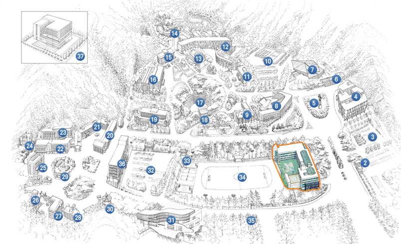

<br>

<!-- <center></center>   -->


<!-- Try changing a few things and reknitting a single page or rebuilding the whole site. Do your own thing, or here are a few things to try:  -->

<br> 

## 指引路



<!-- You'll need to add it to the nav bar in `_site.yml` too. -->

**研究室位置**
<br>
大田广域市西区培材路155-40（桃马洞）培材大学21世纪馆P342号

**研究室联系方式**
<br>
042-520-5348

**路线**
<br>

```
1.屯山市外客运站→屯山CGV前门，史前遗址公交站，乘坐301路公交（乘坐10站）→培材大学站下车（预计花费24分钟）

2.屯山高速巴士客运站→102路公交→216路公交
徒步约7分钟到达巢穴公寓公交站→在巢穴公寓公交站乘坐102路公交（乘坐1站）→政府大楼站下车→在政府大楼站乘坐216路公交（乘坐10站）→培材大学站下车（预计花费46分钟）

3.大田裕城客运站→裕城市外巴士站，乘坐312路公交（乘坐15站）→培材大学站下车（预计花费47分钟）

4.大田西部客运站→徒步约9分钟到达桃马桥公交站→在桃马桥公交站乘坐312路公交（乘坐6站）→培材大学站下车（预计花费33分钟）

5.大田综合大楼客运站→601路公交→612路公交
徒步约6分钟到达综合大楼公交站→在综合大陆公交站乘坐601路公交（乘坐9站）→太平五街公交站下车→在太平五街公交站乘坐612路公交（乘坐12站）→培材大学站下车（预计花费56分钟）

6.大田站→在大田站公交站乘坐613路公交（乘坐18站）
边东中学公交站下车→徒步约10分钟到达培材大学（预计花费51分钟）

7.西大田站→612路公交
徒步约4分钟到达西大田站公交站→在西大田站公交站乘坐612路公交（乘坐18站）→庆南公寓公交站下车（预计花费39分钟）

8.出租车（预计花费34分钟，10900韩元）
```